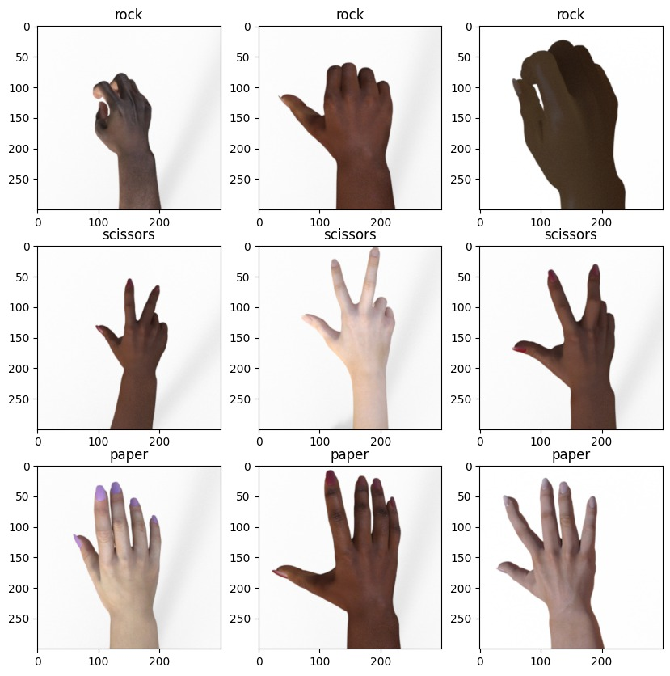

# UAP-Smt7-Namirah-Rahmah-Putri_202010370311204

<!-- PROJECT LOGO -->
 

    

<h1 align="center">Rock, Paper, Scissors Prediction</h1>
  

    Project ini berfokus untuk memprediksi gambar (Rock, Paper, Scissors) dengan model VGG19
  

## Author : Namirah Rahmah Putri_202010370311204 

## DATASET 
Dataset yang digunakan dalam project ini berisi total 2520 gambar dengan pembagian setiap kelas berjumlah sama : 840 gambar (dibagi secara rata). [Link dataset dapat diakses di sini.](https://drive.google.com/drive/folders/1rpn0itTAOCvTuLxdJnnhGDH5OxkJGNCA?usp=drive_link)

    

